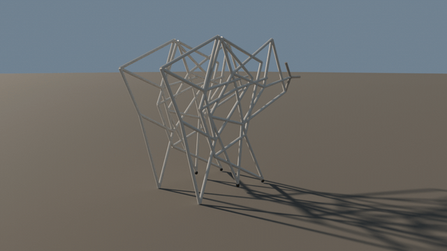

# 🦿 Linkage Studio — Blender

**EN:** A Blender add-on that builds walking machines from **Jansen's linkage** — the 11-bar mechanism behind Theo Jansen's Strandbeest. Pick a leg count in the N-panel, click *Build*, and get a machine whose every bar position comes from the **closed-form kinematic solution** of the linkage. No keyframe acting, no easing fakes: each frame is solved from trigonometry, then keyed LINEAR.

**TR:** Theo Jansen'in Strandbeest'lerinin arkasındaki 11 çubuklu **Jansen mekanizmasıyla** yürüyen makineler kuran Blender add-on'u. N-panel'den bacak sayısını seç, *Kur*'a bas; her çubuğun konumu bağlantının **kapalı-form kinematik çözümünden** gelir. Keyframe Oyunculuğu yok, easing sahteciliği yok: her kare trigonometriden çözülür, LINEAR anahtarlanır.



*6-leg machine, one crank cycle — the body advances at true stride speed, so stance feet stay pinned to the ground. — 6 bacaklı makine, tek krank çevrimi; gövde gerçek adım hızıyla ilerler, yerdeki ayaklar zeminde sabit kalır.*

## 📐 The mechanism / Mekanizma

**EN:** The leg is Jansen's linkage: a 15-unit crank driving a truss of ten bars (41.5, 50, 55.8, 40.1, 39.3, 61.9, 39.4, 36.7, 65.7, 49) mounted on two ground pivots 38.0 × 7.8 apart. One degree of freedom — turn the crank and the foot traces a stepping loop: a flat *stance* arc (~52% of the cycle) that propels, and a *swing* arc that lifts 22.5 units. The solver is pure Python: circle–circle intersection in a fixed branch order, closure error **< 1e-13** over the full revolution.

**TR:** Bacak Jansen bağlantısı: 38.0 × 7.8 aralıklı iki sabit mafsal üstünde, 15 birimlik krankın on çubukluk (41.5, 50, 55.8, 40.1, 39.3, 61.9, 39.4, 36.7, 65.7, 49) bir kafesi sürüklemesi. Tek serbestlik — krankı çevir, ayak bir adım döngüsü çizer: iten düz *stance* yayı (çevrimin ~%52'si) ve 22.5 birim kaldıran *swing* yayı. Çözücü saf Python: sabit dal sırasıyla çember-çember kesişimi, tam turda kapanma hatası **< 1e-13**.

Measured gait (standard proportions): / Ölçülen yürüyüş (standart oranlar):

| Metric / Metrik | Value / Değer |
|---|---|
| Stance share / Yerde kalma | %52 |
| Step height / Adım yüksekliği | 22.5 birim (≈ 0.67 m @ 0.03 ölçek) |
| Stride / Adım boyu | 64.9 birim (≈ 1.95 m) |

## 🖥️ Add-on / Eklenti

1. `Edit > Preferences > Add-ons > Install from Disk…` → `linkage_studio.zip`
2. N-panel (sağ kenar) → **Linkage** sekmesi
3. Bacak sayısı (2–12), ölçek, çubuk çapı, çevrim karesi → **Yürüyen Makine Kur**

**EN:** Legs are paired left/right at the same station and walk in phase; adjacent pairs step 360°/pairs apart, so a 6-leg machine always has both tracks on the ground (gate G6 proves it numerically). The 2-leg build is a walking antiphase pair.

**TR:** Bacaklar aynı istasyonda sol/sağ çift hâlinde aynı fazda yürür; ardışık çiftler 360°/çift kadar kayar — 6 bacaklı makinenin her iki rayı her an zeminde (G6 kapısı sayısal kanıtı). 2 bacaklı kurulum antifaz yürüyen tek çifttir.

## 🧪 Gates / Kapılar

`python3 tests/verify.py` — Blender gerekmez:

| Gate | Ne kanıtlar / What it proves |
|---|---|
| G1 kapanma | Tüm çubuklar 360° boyunca boylarını koruyor (< 1e-6) |
| G2 sabit mafsallar | Zemin noktaları krankla sürüklenmiyor |
| G3 süreklilik | 1440 açıda tek dalda çözüm — ayak hiç sıçramıyor |
| G4 yürüyüş | Ayak izi gerçek adım profili: %35–65 stance, 15–30 kaldırma, 40–90 adım boyu |
| G5 fazlar | Antifaz çift zemin ayırıcısını geçiyor |
| G6 çok bacak | 6 bacaklı dizilimde zemin her an temas altında |

Blender içi uçtan uca: `blender --background --python tests/e2e_addon.py` — add-on kaydı, 6/2 bacaklı kurulum, LINEAR anahtar denetimi.

## 🎬 Cinematic render / Sinematik render

```bash
blender --background --python render_walk.py -- --preview   # 4 kare 640x360
blender --background --python render_walk.py               # 48 kare 960x540
```

**EN:** The body translates at exactly `stride / cycle` per frame while the camera runs alongside — feet in stance stay fixed relative to the ground, which is what makes the walk read as *real*. Cycles GPU (Metal), AgX.

**TR:** Gövde kare başına tam `adım boyu / çevrim` ilerlerken kamera yanında koşar — stance'taki ayaklar zemine göre sabit kalır, yürüyüşün *gerçek* görünmesinin sırrı bu. Cycles GPU (Metal), AgX.

## 📄 License / Lisans

MIT
